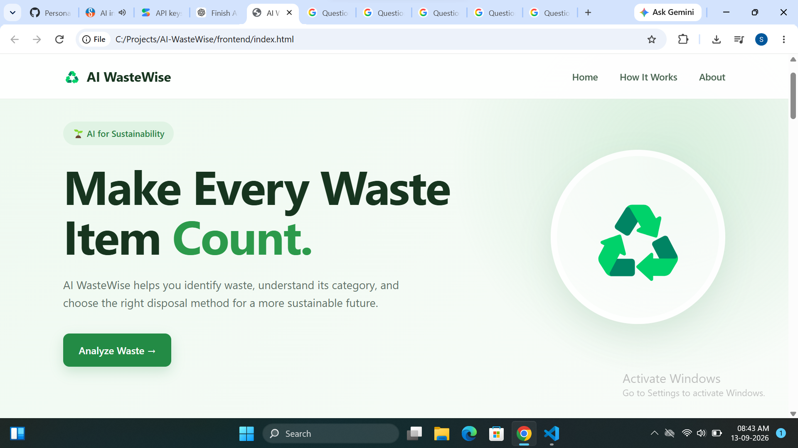
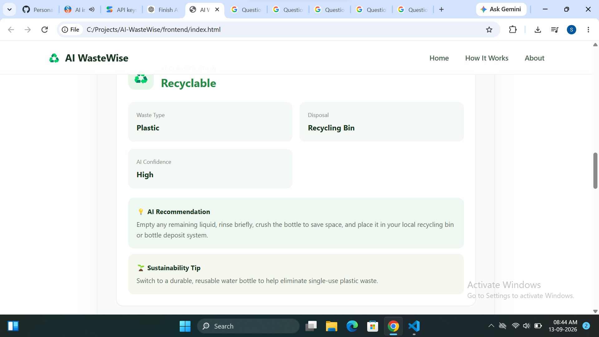
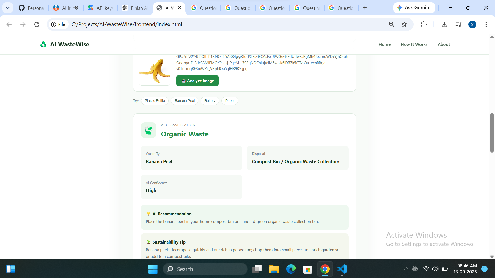
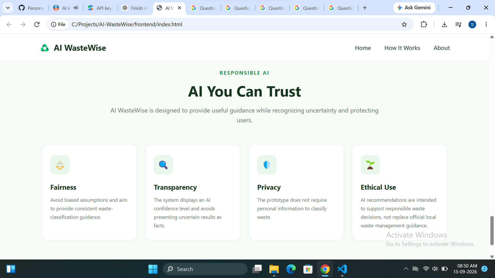
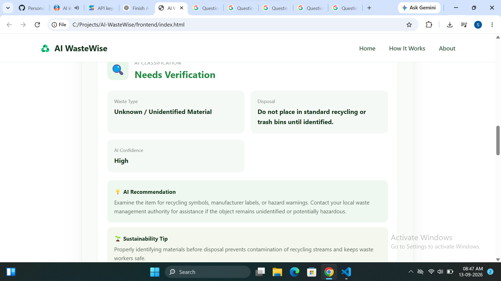

Perfect 👍 Let's create the **professional `README.md`** for your GitHub repository.

### 1. Open your project

In VS Code:

```text
AI-WasteWise
```

Create/open:

```text
README.md
```

### 2. Paste this content

````markdown
# 🌱 AI WasteWise

### AI-Powered Waste Segregation & Sustainability Assistant

AI WasteWise is a multimodal AI-powered web application that helps users identify different types of waste and make better disposal decisions.

Users can provide a waste item through **text or an image**, and the system uses **Gemini AI** to analyze the input and provide waste classification, disposal guidance, confidence information, recommendations, and sustainability tips.

---

## 🎯 Problem Statement

People often face difficulty identifying the correct category and disposal method for different types of waste.

This uncertainty can lead to improper segregation and mixing of recyclable and non-recyclable materials.

Students, households, offices, campus staff, and communities need a simple and accessible way to identify waste and receive appropriate disposal guidance.

AI WasteWise addresses this problem by using AI to analyze text or images of waste and provide practical disposal guidance.

---

## 💡 Proposed Solution

AI WasteWise provides a simple AI assistant where users can:

- Enter a waste item as text
- Upload an image of waste
- Get AI-based waste classification
- Receive disposal recommendations
- View AI confidence information
- Get sustainability tips
- Handle uncertain classifications through verification guidance

---

## ✨ Key Features

### 📝 Text-Based Waste Analysis

Users can enter waste items such as:

- Plastic water bottle
- Banana peel
- Old mobile phone
- Paper
- Glass bottle

The AI analyzes the description and provides an appropriate recommendation.

### 🖼️ Image-Based Waste Analysis

Users can upload an image of a waste item.

The AI analyzes the image and provides:

- Waste type
- Waste category
- Disposal guidance
- Confidence information
- Sustainability recommendation

### 🤖 AI-Powered Analysis

The application uses **Google Gemini AI** to analyze text and image inputs.

### ♻️ Disposal Guidance

The system provides practical guidance to help users decide how the identified waste should be handled.

### 🌱 Sustainability Tips

Each analysis can include a simple sustainability recommendation to encourage responsible waste practices.

### 🛡️ Responsible AI

The project considers:

- Fairness
- Transparency
- Privacy
- Ethical use
- Uncertainty handling

---

## 🏗️ System Architecture

```text
                    ┌──────────────────┐
                    │      User        │
                    │ Text / Image     │
                    └────────┬─────────┘
                             │
                             ▼
                    ┌──────────────────┐
                    │    Frontend      │
                    │ HTML/CSS/JS      │
                    └────────┬─────────┘
                             │
                             ▼
                    ┌──────────────────┐
                    │   Node.js +      │
                    │    Express       │
                    └────────┬─────────┘
                             │
                             ▼
                    ┌──────────────────┐
                    │   Gemini AI      │
                    │    Analysis      │
                    └────────┬─────────┘
                             │
                             ▼
              ┌─────────────────────────────┐
              │ Classification & Guidance   │
              │                             │
              │ • Waste Type                │
              │ • Disposal Method           │
              │ • AI Confidence             │
              │ • Recommendation            │
              │ • Sustainability Tip        │
              └─────────────────────────────┘
````

---

## 🔄 How It Works

1. User enters a waste item or uploads an image.
2. The frontend captures the input.
3. The input is sent to the Node.js/Express backend.
4. The backend communicates with Gemini AI.
5. Gemini analyzes the waste.
6. The application receives the AI response.
7. The result is displayed to the user.
8. The user receives disposal guidance and a sustainability tip.

---

## 🛠️ Technology Stack

### Frontend

* HTML5
* CSS3
* JavaScript

### Backend

* Node.js
* Express.js
* CORS
* dotenv

### Artificial Intelligence

* Google Gemini AI
* Multimodal AI analysis
* Text and image inputs

### Development Tools

* Visual Studio Code
* Git
* GitHub

---

## 🌍 SDG Alignment

### Primary SDG

**SDG 12 — Responsible Consumption and Production**

AI WasteWise supports responsible waste identification, segregation, and disposal practices.

### Secondary SDG

**SDG 11 — Sustainable Cities and Communities**

Better waste practices can contribute to cleaner and more sustainable communities.

---

## 🧠 Design Thinking Approach

The project follows the Design Thinking process:

```text
Empathize
    ↓
Define
    ↓
Ideate
    ↓
Prototype
    ↓
Test & Refine
```

### Empathize

Understand difficulties people face when identifying and disposing of waste.

### Define

Define the challenge of waste identification and segregation.

### Ideate

Develop an AI-powered assistant capable of handling text and image inputs.

### Prototype

Build a web application using HTML, CSS, JavaScript, Node.js and Gemini AI.

### Test & Refine

Test the system using different waste examples and improve the user experience and AI response handling.

---

## 🛡️ Responsible AI

AI WasteWise considers responsible AI principles throughout the project.

### Fairness

The system should work across a wide variety of waste examples and contexts.

### Transparency

The application presents the AI classification and confidence information so users understand that AI results may involve uncertainty.

### Privacy

The project avoids unnecessary collection of personal information.

### Ethical Use

The application is designed to encourage safe and responsible waste disposal.

### Uncertainty Handling

When the AI cannot confidently identify an item, users should be encouraged to verify the result rather than treating an uncertain prediction as guaranteed.

---

## 📸 Screenshots

### Home Page



### Text Analysis



### Image Analysis



### Responsible AI



### Uncertainty Test



---

## 📁 Project Structure

```text
AI-WasteWise/
│
├── frontend/
│   ├── index.html
│   ├── style.css
│   └── script.js
│
├── backend/
│   ├── server.js
│   ├── package.json
│   └── package-lock.json
│
├── docs/
│   ├── AI_WasteWise_10_Slide_Presentation.pptx
│   ├── ai-workflow.md
│   ├── ai-workflow.png
│   ├── problem-statement.pdf
│   └── project-presentation.pdf
│
├── screenshots/
│   ├── home-page.png
│   ├── text-analysis.png
│   ├── image-analysis.png
│   ├── responsible-ai.png
│   └── uncertainty-test.png
│
├── .gitignore
└── README.md
```

---

## ⚙️ Installation & Setup

### 1. Clone the repository

```bash
git clone https://github.com/DevarapalliSravani05/AI-WasteWise.git
```

### 2. Open the project

```bash
cd AI-WasteWise
```

### 3. Install backend dependencies

```bash
cd backend
npm install
```

### 4. Configure the API key

Create a `.env` file inside the `backend` folder:

```env
GEMINI_API_KEY=your_api_key_here
```

**Never commit or upload your `.env` file.**

The `.gitignore` file already excludes it.

### 5. Start the backend

```bash
node server.js
```

The backend will start on the configured local port.

### 6. Open the frontend

Open:

```text
frontend/index.html
```

in your browser.

---

## 🔐 Security Note

The Gemini API key is stored in the local `.env` file and should never be committed to GitHub.

For sharing the project, use:

```text
.env.example
```

instead of exposing the real API key.

---

## 📊 Expected Impact

### Environmental Impact

* Encourage better waste segregation at source
* Promote responsible disposal decisions
* Increase awareness of waste management

### Social Impact

* Help students and households make quick waste decisions
* Make sustainability information easier to understand
* Encourage responsible environmental practices

### Technological Impact

* Demonstrate multimodal AI for sustainability
* Combine AI classification with decision support
* Provide a foundation for future smart waste-management solutions

> Note: These are expected/planned impacts and are not measured field-study results.

---

## 🚀 Future Scope

Future improvements could include:

* Improved image recognition
* More waste categories
* Localized recycling and disposal information
* Multilingual support
* Campus waste analytics dashboard
* Mobile application
* Smart-bin integration
* Integration with smart waste-management systems

---

## 🎓 Internship Project

This project was developed as part of:

**1M1B AI for Sustainability Virtual Internship**

In collaboration with:

* 1M1B
* IBM SkillsBuild
* AICTE

---

## 👩‍💻 Author

**Devarapalli Sravani**

CSE
Lakireddy Balireddy College of Engineering

---

## 📄 Project Documentation

Additional project documentation is available in the [`docs`](docs/) folder.

* [Problem Statement](docs/problem-statement.pdf)
* [Project Presentation](docs/project-presentation.pdf)
* [AI Workflow](docs/ai-workflow.md)

---

## 🌱 Project Vision

> **Making responsible waste segregation simple with AI.**

---

⭐ If you find this project interesting, consider giving the repository a star!

````

### 3. Save the file

Press:

**Ctrl + S**

### 4. Push the README

In the VS Code terminal:

```powershell
git add README.md
````

Then:

```powershell
git commit -m "Add professional project README"
```

Then:

```powershell
git push
```
